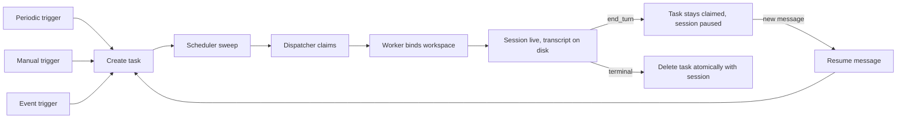

# Designing an Agent Runtime: Spec, Task, Session

When I first sketched the agent runtime, I drew four boxes on the whiteboard. The fourth one was a "run" or "execution" object, meant to hold the state of one invocation of a spec. I am glad it never shipped. What the runtime actually needs is exactly three durable objects, and adding a fourth is the most tempting mistake in the whole design. This post is the field notes from that decision.

## The three objects

The runtime has three durable things.

A **spec** is a durable template. It carries the prompt, the controls and permissions, budget caps, a concurrency cap, and an active kill switch. A spec is what a product owner edits; it is the shape of work, not a particular instance of it.

A **task** is a short-lived queue/claim handle. It says, in effect, "run this spec, now." A task is created, claimed, dispatched, and consumed. It has no prompt and no brain of its own; it is just a pointer from a trigger into the scheduler.

A **session** is the live agent conversation. It owns the workspace, the transcript, the trace, and the pause/cancel/materialized state. A session is what a human actually reads and responds to.

The rule that keeps this clean: every trigger, periodic, manual, event-driven, or a follow-up message resuming an old conversation, funnels into the same path. Create a task, then dispatch it. The moment you special-case "the caller already knows the session id" you get two sessions for one click, and the whole model starts to rot.

## Why there is no "run" object

Every instinct says a run belongs in the model. It does not. A run duplicates state you already hold in the task while it is queued and in the session once it is live. The moment you persist a run, you commit to keeping it in sync with the session forever, and every reconciliation bug lives in that gap. Worse, it invites a second concurrency story: the run's status and the session's status drift, and now two systems decide whether work is happening.

The session is the single source of truth for agent state. The task is a transient handoff. The spec is the template. There is no room for a fourth. This is the tradeoff that bought me everything else in this post: less state, one concurrency mechanism, and restart recovery that is a lookup table rather than an ad hoc mash.

## A task is per session, not per turn

A task is created once per alive session, not once per turn. This trips people up. After the agent calls end_turn, the session is paused but still on disk, and the task stays claimed and "running." A follow-up message from the human lands in that session's event file, and the interrupt hook picks it up without needing a fresh scheduler claim. The task is deleted atomically with the terminal session write, and never on its own.

Delete a task on its own and you leak sessions that think they are alive. Tie its lifetime to the session's and you get atomicity for free: either the session finished and the task goes with it, or neither happened.

## Two loops, one dispatcher

The scheduler is two loops. A lease-protected sweep materializes periodic tasks, rescues stale or orphaned tasks, and enforces timeouts. A dispatcher claims queued tasks and hands them to a worker. Restart recovery flips orphaned running tasks back to queued, so a worker restart resumes straight from the on-disk transcript. There is no separate "resume" service; the transcript is the resume point.

```python
def dispatch_loop():
    for task in tasks_claimable():
        with task.claim():
            worker.dispatch(task.spec)
```

The reason the sweep needs a lease: on a replicated deployment, two schedulers must not both rescue the same orphan. The lease is what makes the sweep idempotent across replicas.

## Caps are row locks, and double enforcement breaks

Budget and concurrency caps live on the spec. They are enforced with row locks, select_for_update, so two workers cannot double-run the same spec. Here is the trap: enforcing the cap in the API and again in the worker, with two different queries, is exactly how you double-run under replicas. Each check passes in isolation because each reader sees a stale count. Enforce once, at the point of claim, under a lock, and replicate the whole unit. Splitting the enforcement across layers is the bug, not the fix.

## Cascade controls, and do not bump updated_at

Editing a spec's controls must cascade to its open sessions with a bulk queryset update. It also must not bump the session's updated_at, because that field means "the agent did something." A controls edit is not agent activity; it is configuration. The bulk update deliberately skips auto_now, which means a product owner can change permissions on live sessions without every open session looking "touched" to any monitoring that keys off updated_at. That skip is a feature, not a shortcut.

## Revive, do not fork

A terminal session that receives a new message is still the same session. Reset it to pending, clear the pause reason, and enqueue a message task. Forking a new session to "cleanly restart" throws away the workspace and the trace, which are the only things that make the conversation debuggable. The UI should retry when dispatch cannot bind a session; it should not mint a session id up front and hope the worker uses it. The worker is the only component that can bind a workspace, so preallocating session ids in the API is a lie waiting to bite.

Similarly, do not expose task ids in the product UI. If the runtime is working, a task id vanishes a second after it is created. Session ids persist. Never surface a transient id to a human.



## Cancel reasons are distinct terminal states

Cancel reasons route to different terminal states. A user stop becomes cancelled. A user completing the work becomes completed. Hitting the duration budget becomes paused, which is resumable, not failed. Keeping paused distinct from failed keeps on-call alerting clean: an expensive agent that blows its budget is business as usual and should not page anyone, while a hard failure is a different signal. Collapse these and your alerting becomes noise.

## Dispatch latency and the capability boundary

User-driven turns dispatch inline before returning 202, so the UI never waits for the next scheduler tick. Cadence-spawned tasks tolerate waiting at most one tick. That asymmetry is invisible to users but keeps the interactive path snappy without a bespoke fast lane.

The spec is also the capability boundary, not just a template. A product feature is a spec with a key. It reuses the same dispatcher instead of growing a second one. Every time someone proposes a "new execution path," the answer is a new spec, not a new scheduler. The runtime stays small because features are data, not code.

## What I would not do again

I would not spend a cycle modeling a run object, and I would not write a second cap-enforcement query. Both sound like prudent engineering and both are the exact root of the double-run bugs I spent the longest chasing. I would also not let the API mint session ids. The worker owns binding, and pretending otherwise produces threads you cannot reconcile.

If I had one sentence for anyone building this: hold the session as the single source of truth, make every trigger walk through task creation, and refuse every fourth durable object that someone proposes.
