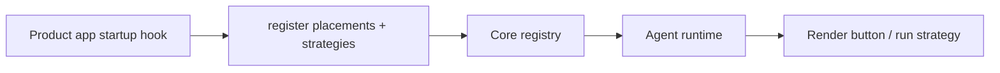

# Placements: Where a Shortcut Appears, and What It May Carry

A shortcut is a small thing. A button that renders somewhere in the UI and, when clicked, gives an agent a slice of context to act on. But "somewhere" and "what it carries" are two questions that, handled lazily, turn a small thing into a source of silent data-shape bugs across tenants. This post is about how we answer both questions in code, at registration time, and why that ordering matters.

## Two questions, answered in code

A placement answers exactly two questions:

1. Where does this shortcut's button render?
2. What context does it hand to the agent?

The natural instinct is to store those answers in the tenant database, so an operator can move a button or widen a payload without a deploy. We rejected that. Placement is product logic, not configuration. It belongs beside the code that builds the UI state, versioned with it, and reviewed with it. If it lives in a database, you get half-dark deployments where the button renders in one environment with a payload shape no agent was built for.

## Exact pairs, no latest

A placement is registered as an exact pair: a key plus a context schema version.

```text
register({ key: "action-row", version: 2, policy: "required", ... })
```

There is no implicit "latest" fallback. Re-registering an occupied pair is an error. The same key may register a later version, which gives you a clean upgrade path, but at any moment exactly one version is authoritative. Clients pin the version explicitly. A frontend built for version 1 talking to a backend that moved to version 2 fails loudly at the boundary instead of silently sending a shape neither side expects.

## Registry inversion

The agent runtime never imports the product app. That boundary is absolute, and it is what keeps the core generic. Product apps register their immutable placement descriptors and async strategies from their own startup hook.



The runtime owns the registry lifecycle and the validation; the product owns the content. Adding a new slot to a product never touches the runtime, and the runtime stays reusable across products. The dependency points in one direction.

## Strategies do two things

A strategy reduces the current UI state into normalized, opaque agent context and returns an optional canonical parent reference: session id, account schema, tenant id. Two properties matter here.

First, the output is normalized and opaque. The agent gets structured context, not a free-form blob it has to guess about. Second, clients and shortcut rows never choose linkage. If a row could set its own parent relation, two tenants rendering the same template could disagree about what a run is attached to. The registered strategy is the single place that decision lives.

## Linkage policy is in the descriptor

The descriptor declares the linkage policy as one of three values: forbidden, optional, or required. The core validates the resolved parent against that policy at runtime.

An action-row placement requires the current session as parent; the strategy resolves it and the core checks it. An alert-list placement forbids any parent and carries zero to N selected ids plus the selected accounts; here an accidental parent would corrupt the semantics, so "forbidden" makes the core reject it outright.

## Bound the context

Context is serialized as compact JSON, and a size limit is enforced both before and after the strategy runs. The before-limit stops a strategy from pulling a huge tree just to trim it; the after-limit catches a strategy that carved the tree down too slowly. The result must be a normalized object, not a free-form blob. Unbounded context is how a shortcut becomes a parked database dump in the prompt.

## Do not trust the browser for tenant identity

The frontend sends reduced ids and candidate account schemas, never a resolved tenant identity from the browser. Two tenants can mint the same id, so the backend resolves authorized account rows and rejects cross-schema id collisions. The browser's word about *what* is selected carries weight; its claim about *whose* data that is does not.

## Empty selection stays empty

Empty selection means "nothing selected", never "all filtered rows". This is a small decision with large consequences. An empty list that silently expands to a bulk action is exactly how you email the wrong customers. When the alert list has no selection, the strategy emits zero ids, and a bulk operation demanding a parent or a selection fails instead of guessing.

## One validator, many callers

Registration-time validation is pure and never touches the database. An unassigned slot returns none, a half pair fails as incomplete, and an unavailable exact pair returns one clear error. The same validator is reused by health, readiness, and launch, so there is exactly one definition of "valid placement" in the system. A placement that passes at registration is valid everywhere, and one that fails is rejected with the same message in every path.

## Context and linkage are independent on purpose

On launch, the adapter writes the normalized context to the session's input area before dispatch. Linked runs additionally set the normal session parent relation. The two are decoupled by design:

| Placement | Carries context | Requires parent |
|-----------|-----------------|-----------------|
| Alert action row | yes | yes |
| Alert list | ids, accounts | no (forbidden) |
| Diagnostic helper | yes | yes |

A placement can carry context without creating a parent, or require a parent without carrying a payload. Coupling them would force every context-carrying shortcut to fabricate a session, or every linked shortcut to mint unnecessary context.

## The registry is not portable

A process-local registry is not portable data. A bundle imported into another environment keeps its placement key, but the startup hook that registered it may not exist there, so the placement lands disabled with a warning. That is correct behavior. Pretending the slot exists would render a button whose strategy is absent and whose context can never be produced. A disabled placement is honest; a phantom one is a landmine.

## What I would change later

The size limits and linkage checks are hardcoded policy in the core; they could become per-strategy knobs if a future product needs a genuinely different contract. But I would not add that knob until a concrete request shows up. The design holds because placement, strategy, and linkage all live in code and all have exactly one owner.
