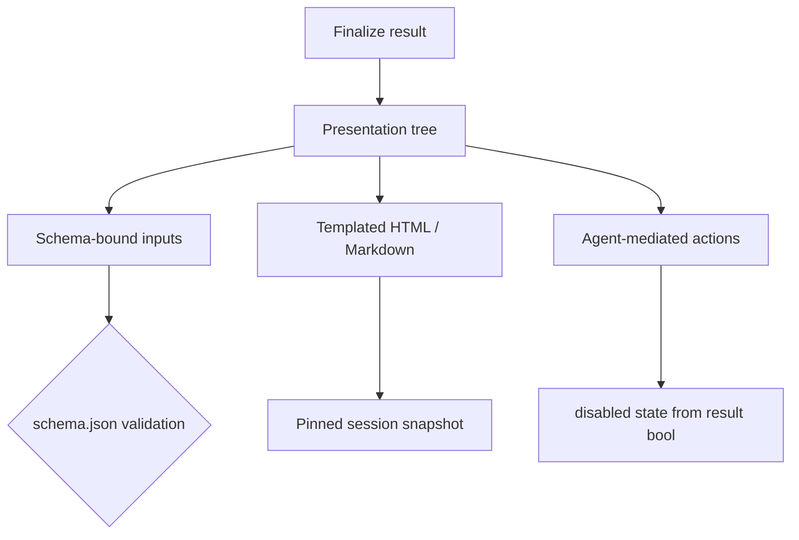

# Presentations: A Schema-Bound UI for Agent Results

An agent produces a structured result, and you want a real UI around it. Not a wall of JSON, not raw markdown, but a form, a report card, editable fields, a confirm button. The tension is immediate: every widget you expose is a place a customer could smuggle code into your product, and nobody wants to ship arbitrary HTML and JavaScript into a hosted runtime.

This post is about the boundary we drew to solve exactly that: a presentation is a small, schema-bound tree that descends from the agent's result, and the host renders it. The agent stays responsible for data. The host stays responsible for pixels.

## The contract hangs off the result

The presentation rides on the existing result-schema family under a `presentation` key. It is not a separate mechanism and it does not open a second channel. The agent's finalize call remains the only agent-to-UI communication path. There is no side door for the agent to mutate UI state on its own.

That decision matters more than it sounds. If an agent could reach into the UI directly, you get a product where the agent's behavior and the interface drift apart and neither side can be reasoned about in isolation. By forcing every UI descent through the finalize result, the presentation is always derived from data the schema already owns. The UI is a projection of a validated result, never an independent actor.

## A deliberately small tree

A presentation is one recursive stack tree: a single `row` or `column` of ordered leaf nodes. That is the whole shape. Three families of leaf nodes exist right now:

- **Ordinary schema-bound inputs.** Plain fields that bind directly to the result schema.
- **Editable templated HTML or Markdown.** Content seeded from the authoritative finalize artifacts, rendered as a template.
- **Agent-mediated actions.** Buttons whose disabled state is driven by a boolean from the result, and whose click revives the session.

The tree shape is intentionally small. When we need a new widget, we register a new kind, not loosen the grammar. That is the escape valve: extensions happen at the node type level, and each new kind goes through the same validation and pinning path as the originals. The grammar stays closed; the widget catalog grows deliberately.

## Own the data, pin the assets

`schema.json` owns data validation, full stop. Templates, assets, and metadata are not read live off a mutable bundle at render time. They are pinned into the session snapshot when the session starts. If the bundle changes after that point, the running session keeps rendering the version it started with.

This is the property that makes the thing auditable. Validation is whole-family and strict in three places: on write, on read, and when the pinned snapshot is constructed. A diagram or doc that starts rendering in one state cannot silently flip to another mid-session because someone edited a template while it was live.

One asymmetry worth calling out. Ordinary templates tolerate a dangling reference. Presentation bindings reject one. The reason is blunt: a broken doc reference is a broken paragraph, but a broken binding is a broken button. One is a cosmetic defect, the other is a control that silently does nothing. And supported `$ref` sibling constraints are conjoined rather than ignored, because dropping a sibling constraint is how you turn a "greater than zero" field into a free-for-all.

## Rendering is host-controlled

Customer HTML is never trusted. It renders inert, in a sandboxed frame with no script and no event handlers. The host paints; the customer provides content and data, and nothing more.

I will be clear about the limits here, because pretending otherwise is a liar's move. The later hardening work, URL and attribute validation, is explicitly deferred. Static HTML is not safe by default, and a sandboxed frame without script does not make it safe. If you are reading this and building something similar, schedule that hardening as a first-class defect with an owner and a date, not as a "soon." The sandbox is a boundary, not a promise.

## The interaction loop

The agent completes its first turn and finalizes a result. The presentation seeds its fields from that result. A human reads the report card, edits the fields, and hits submit. The action uploads the field values to the session's input path and posts a fixed instruction message, which revives the same session, so the agent continues with the human's edits already in context. Human drafts override result keys for live rendering, which means the form reflects what the human changed, not what the agent said last.

Two details make this loop work well. First, it is one session, not a fork. The agent that made the claim is the agent that is corrected, so it has the full context of its own work. Second, the instruction message is fixed, not agent-authored, which keeps the revive path predictable and testable.

## The agent should not paint pixels

The core stance is that the agent owns data and the host owns rendering. That boundary is what makes the same result renderable in a chat panel, a modal, and an export, without any of them knowing about the others. A UI built on data is portable; a UI built by the agent is not.

## Tradeoffs, stated plainly

First, the first version has no true read-only node. Every input is editable by default, which is fine for a report card you want corrected but inconvenient for a status that should be fixed. Second, result-artifact pairing is not atomic yet. A result and its paired artifacts can theoretically straddle a version. Third, HTML sanitation is staged after the contract, so the first versions ship with the sandbox and the deferred hardening outstanding.

All three are deliberate and documented, assigned to later stages, not oversights. Shipping the boundary first, with known weaknesses named, is the right call against shipping nothing while we try to get everything perfect at once.
