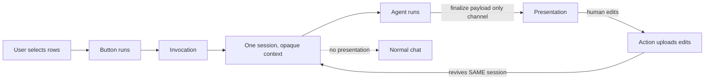

# Turning an Agent Workflow Into a Product Button

The most useful thing an agent platform can do is stop thinking of agent runs as one-off chats and start thinking of them as invocations. A customer defines a workflow once, then runs it a thousand times from a button. That shift, from conversation to product surface, is most of the product value.

## The shortcut is a spec, and nothing else

A shortcut is a customer-defined agent workflow backed by exactly one spec. The spec is a prompt plus tool permissions plus a budget.

Here is the whole trick: the shortcut layer has no semantic knowledge of the domain. It does not know whether the workflow sends invoices, triages tickets, or reconciles ledgers. The spec's tools and controls are the sole capability boundary. The platform never learns what the workflow does.

That ignorance is what makes the feature scale operationally. There is no per-domain logic to maintain, no catalog of automations to keep current, no schema that has to understand each customer's business. The platform stays thin and the customers stay flexible. Every time I was tempted to add domain awareness, I cut it. It was always a maintenance burden with no paying user attached.

## One invocation, one session

A shortcut invocation always starts or continues exactly one session. If a user selects 50 rows and hits the button, those 50 rows are opaque context handed to a single agent. They are not 50 fan-out sessions.

This is the discipline to defend. The moment you fan out per item you are re-inventing a batch job and handing the user all the failure modes of parallel execution: partial success, duplicated side effects, no single story of what happened. A bulk selection is context, not a concurrency primitive.

## Identity as a name you can defend

The shortcut is identified by a key, and identity is derived from the name. The key owns a spec named for K and a result-schema family named for K. Lookup is cheap and namespace rules are trivial to reason about.

The cost is a reserved prefix you must defend. Since the key, the spec name, and the schema family all share the key's prefix, you need an explicit rule that ordinary users cannot create specs in that reserved namespace. That reserved-namespace problem is a recurring tax through this whole design. Name it early and defend it everywhere, or it leaks.

## The UI is a byproduct of the session

The most common mistake is to plan the UI before the agent runs. Write the spec, build a form, launch the agent. Wrong order.

Prepare the UI inside the agent session, not before launch. The agent runs, then calls its finalize tool. That finalize payload is the only agent-to-UI channel. An optional presentation is seeded from the finalize artifacts. A human can edit the fields, and an action uploads the edited values and revives the same session.

No presentation means the shortcut behaves like a normal chat. The presentation is genuinely optional, and that keeps the contract honest: the agent produces a payload, the host renders it, the human can edit it.

## Keep customer HTML inert

The presentation contract is a host-rendered declarative tree that grows one widget at a time. Do not let customers ship executable HTML. Arbitrary script inside an iframe is a security and lifecycle problem, not a feature.

This is worth being stubborn about. Customer-authored HTML sounds like flexibility and behaves like a sandbox you are now on the hook for. A declarative tree the host renders keeps the surface small, testable, and safe. There is no good version of "the customer sends us a script."

## Authoring is privileged

Authoring is a separate privileged concern. A reserved system spec drives a builder session that writes the workflow bundle through an explicit save tool. Ordinary users cannot create specs in the reserved namespace.

The builder session gets a narrow allowlist and a small budget. It is the one place where the platform is opinionated about what a shortcut may contain, and it has to be. Give the authoring path too much freedom and the reserved namespace becomes unmanageable.

## Portability with teeth

Export is a closed manifest with an explicit version. It carries the key, the spec controls as stored (an empty prompt is legal), the mandatory result-schema family, the selected stable skills, and placement keys as opaque strings.

Import is create-only. It refuses on any key, spec, schema, or filesystem collision with a 409. It lands disabled. It rolls back in reverse order only the rows it inserted. Existing destination skills are skipped by name, never forked.

Two details carry most of the weight. First, an empty prompt is legal, because some workflows are pure tool composition with no instruction. Second, the result-schema family is mandatory; a bundle without it cannot run, so make it impossible to export one without it.

Export is not an authorization gate. Runtime skill permissions answer "what may the agent load when it runs", not "what may an operator bundle". The only export checks are existence of the selected stable skills and completeness of the mandatory result schema. Anything stricter, and export quietly becomes a security boundary it was never meant to be.

## Placements are code, not data

Placements are process-local code, not portable data. Copying a placement key into another environment does not install the hook. Import keeps the key, leaves the shortcut disabled, and returns a warning.

This is a deliberate honesty about what a bundle can carry. A bundle is data; a placement is code. Pretending otherwise produces an import that silently half-works. Import cleanly, leave it disabled, and let the operator install the hook for real.

## Compute health, don't store it

Health is computed, not stored: healthy, incomplete, or broken. A signed ownership token bound to the tenant, the shortcut, the spec version, and the canonical bundle name decides whether a destructive operation is allowed. Repair is explicit; never silently overwrite someone else's spec or delete skill rows they still use.

The token is the interesting bit. It ties a destructive action to a specific bundle at a specific version, so a stale or cross-tenant overwrite fails on signature even if everything else lines up.

## Tradeoffs I am making on purpose

A few things are not done yet, and I want them named so nobody mistakes them for complete.

The initial version is direct-save with a review or publish step in the builder, not a full approval workflow. A two-person review loop is better governance but worse velocity.

Static HTML is inert and some sanitation is a later hardening step. The declarative contract buys safety now; sanitation is defense in depth later.

Process-local placements mean a bundle is not fully self-contained. That is a real limitation, and the import flow tells the operator rather than hiding it.

## What I would keep

If I had to rebuild this, I would keep the spec as the sole capability boundary, the one-invocation-one-session rule, the prepared-inside-the-session UI, and the host-rendered inert presentation. Those four decisions are the product.

The noise comes from everything that wants to add knowledge: fan-out, domain awareness, customer HTML, export-as-auth. Cut all of it.
