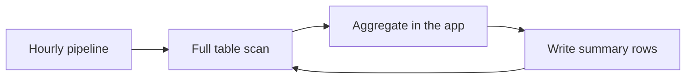

# Most of the AWS Bill Was One Slow Query

## TL;DR
The invoice looked like a compute problem. It was a query problem. RDS was the large line because a few analytics jobs scanned millions of rows every hour, then wrote the result back into the same instance. I cut the bill about 80% by reading the slow-query log, adding the indexes the planner actually wanted, and stopping the pipeline from materializing columns nobody read.

---

## What the dashboard lied about

CloudWatch said CPU was high. The instinct is bigger instances. The slow-query log said sequential scans on tables that already had indexes, just not the ones in the `WHERE` clause.

The loop paid for storage, I/O, and CPU on every pass. Snowflake had a similar shape: wide extracts, then a BI tool that filtered in memory.

## What actually moved the number

- **Indexes that match the predicate.** A composite on `(account_id, created_at)` beat a single-column index the ORM had created for the PK lookup.
- **Stop selecting `*`.** The pipeline pulled JSON blobs to compute a count. `COUNT(*) FILTER` in SQL was cheaper than shipping the blob.
- **Batch the write.** One `INSERT ... SELECT` replaced thousands of ORM inserts.
- **Instance size last.** After the queries shrank, a smaller RDS class held p99. Reserved instances on the old size would have locked in the waste.

Snowflake followed the same rule: fewer columns in the unload, cluster key on the filter column, drop the extract that existed only because a dashboard used to need it.

## What I would not do again

- Trust a cost dashboard without the query text.
- Add a cache in front of a scan. You are caching the mistake.
- Tune `work_mem` before you look at `EXPLAIN`.

The 80% number is real. It is also boring: the expensive thing was doing the same full scan every hour and calling it a pipeline.
