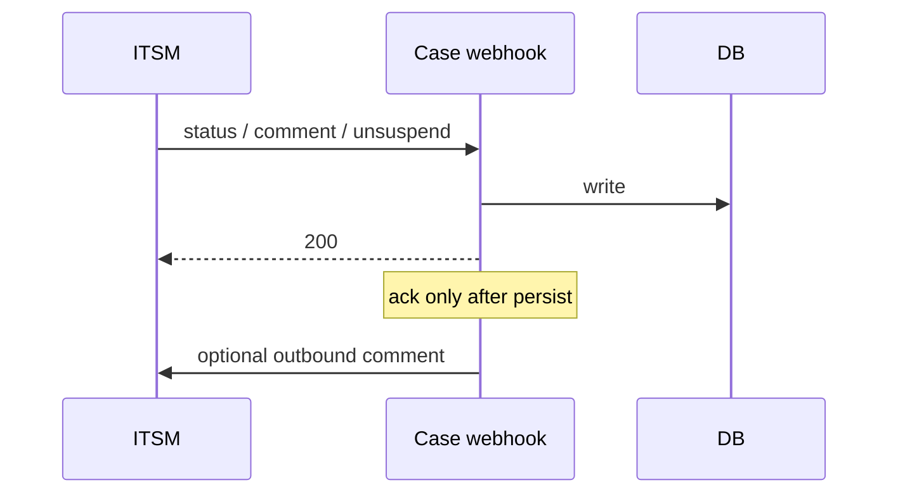

# The Case Webhook Has to Ack, Then Act

## TL;DR
Ticketing systems retry. If your handler does the work and then fails to return 200, you get duplicate comments, duplicate status changes, and a thread that closed itself. The other way is worse: return 200 and then crash, so the far side thinks it landed and you never wrote the row. Pick ack-after-persist, and do not treat every field patch as a customer-visible comment.

---

## The loop

Handlers we actually needed: add comment, unsuspend, reopen, resolve, suspend. Each one maps to a case transition plus an optional outbound note. Custom HTTP tools on our side fire when the case event happens (reopen, escalate), so the remote ticket stays in sync both ways.

## Rules that paid rent

- **Ack after 200 only when the row is in.** If you ack first, retries will not save you from a crash. If you act then fail the HTTP response, they retry and you duplicate.
- **Do not close the comment thread on Done.** Done is a status. The customer still replies. Closing the thread made the next inbound comment a 404 in our UI.
- **Do not send an outbound comment on every field change.** A severity edit is not a customer message. We had to stop echoing internal patches. Outbound is explicit: this handler wants a comment.
- **Serialize the remote id.** Webhooks that omit `source_id` cannot ack the right incident. Include it even when the body already has a ticket number. The two are not always the same.

## Ordering

Comment tool before resolution. If you resolve first, the remote ticket is closed and the comment is dropped or requires a reopen. The handler order is data, not style.

Hold-until and close notes belong on the same outbound payload as the status change. Two calls race.

## What I would not do again

- One generic "on case change" webhook that always posts a comment.
- Treat Done as terminal for the thread.
- Parse the remote payload twice, once for ack and once for the write. They will drift.
