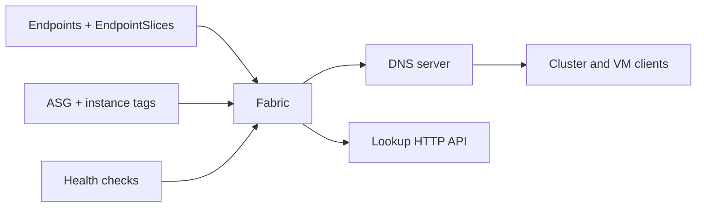

# Fabric: One DNS View for Kubernetes and EC2

## TL;DR
Some workloads stayed on EC2. Some moved to GKE. Clients should not care. Fabric is a Go control plane that watches both, health-checks both, and serves one DNS view. CoreDNS in the cluster is not enough: it does not know about the VMs, and the VMs do not run kube-proxy.

---

## The split brain

Kubernetes gives you `foo.ns.svc.cluster.local`. EC2 gives you an instance tag and an IP that changes on replace. A client in the cluster that needs a VM, or a VM that needs a ClusterIP, has no shared name.

## What Fabric stores

A record is `(name, set of backends, health)`. Name is a short DNS label, not a cloud resource ID. Backends are IP:port plus a source (`k8s` or `ec2`) so you can debug which watcher filled them.

Health is active, not "the API said it was running". An instance in service with a dead process is the common failure. Fabric probes the port it is about to serve.

Kubernetes watchers follow EndpointSlices. EC2 watchers follow ASG instance state plus a tag for the Fabric name. A missing tag means the instance is not in the mesh. Silent inclusion of every VM in the VPC is how you serve a bastion as `payments`.

## DNS vs the HTTP API

DNS is for clients that already speak it: sidecars, legacy JVM, anything that cannot take a library. The HTTP lookup is for things that need all backends, not a single A record, so they can do their own picking.

TTL is short. Caching a dead backend for 60s is worse than extra lookups. The server is anycast-ish inside the VPC; clients do not pick a Fabric replica.

## What I would not do again

- Reuse Kubernetes Service names as the global names. Namespaces collide across clusters.
- Trust cloud "healthy" without an application probe.
- Put service discovery in the load balancer. The LB is a backend of Fabric, not the source of truth.
