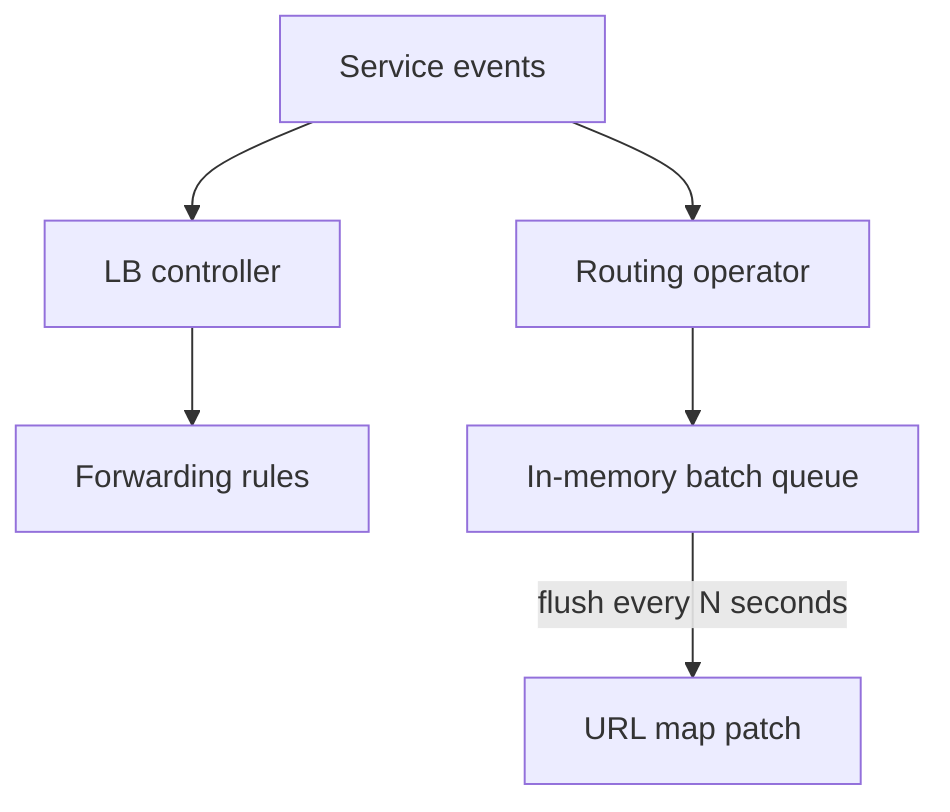

# Two Operators, Because GCP Rate-Limited the Obvious Path

## TL;DR
Per-Service GCP load balancer calls looked clean in a demo and fell over in a multi-cluster rollout. I split the work into two operators: one provisions the load balancer, one batches routing-rule updates. The split exists because the routing API is the slow one, and reconciling it on every Service event is how you hit quota.

---

## The naive controller

Watch Services. For each one, ensure a forwarding rule, a backend, and a URL map. That is one GCP write per object, per reconcile, with retries.

At a few hundred Services the API starts returning 429. Kubernetes then requeues. You now have a thundering herd against the same quota.

## Why two operators

Load balancer identity changes rarely: create, delete, a few annotations. Routing changes constantly: path, backend, health. Mixing them in one reconcile loop means a path edit rewrites the forwarding rule.

The LB controller owns:

- backend service
- forwarding rule
- health check

The routing operator owns:

- URL map path rules
- a queue that coalesces patches for the same map

Flush on a timer, not on every Watch event. Last-write-wins inside the window. The GCP call count dropped from "once per Service per second" to "once per map per interval".

## What hurt

Status on the Service has to point at both owners. If you only record the LB name, a stuck routing patch looks like a provisioned but unreachable Service. Two conditions, two last-error fields.

Also: do not use the GCP client with the default retry on 429 inside a Kubebuilder requeue. You double the backoff.

## What I would keep

- Batch the chatty API. Reconcile the rare API 1:1.
- Own one GCP resource family per controller. Shared ownership is how two loops fight over the URL map.
- Treat quota as a product constraint, not an ops surprise.
