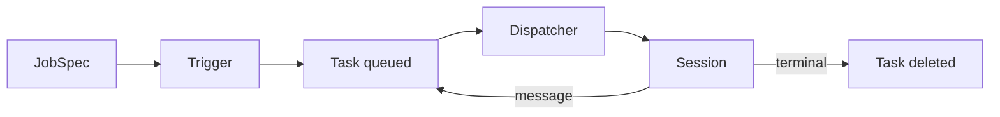

# JobSpec, Task, Session: Do Not Invent a Fourth Object

## TL;DR
The harness is three objects. A JobSpec is the durable definition (prompt, controls, caps). A Task is the queue item that says "run this spec now". A Session is the live agent turn. Launch, resume, and periodic runs all create a Task. The dispatcher claims it and opens or revives a Session. Anything else (a "run" object, a preallocated session id, a public task id) duplicated state we already had.

---

## The path

Triggers are periodic, manual, event, or message (resume). Every one of them should call the same `create task -> dispatch` path. Special-casing "the UI already knows the session id" is how you get two sessions for one click.

## Caps live on the spec

`max_tasks_allowed`, budget, kill switch (`active`). The dispatcher enforces them with `select_for_update`. If you enforce in the API and again in the worker with different queries, you will double-run under two replicas.

When a spec's controls change, push them to open sessions with a queryset update. Do not bump `updated_at` if that field means "the agent did something". `.update()` skipping `auto_now` is a feature here.

## Revive, do not fork

A terminal session that gets a new message is the same session: reset to pending, clear pause reason, enqueue a message task. A new session loses the workspace and the trace. The UI should retry when dispatch cannot bind a session, not mint a session id up front and hope the worker uses it.

Task rows are short-lived. Once the session is terminal, delete the task. Listing tasks as if they were jobs is how operators debug the queue as if it were history. History is the session.

## What I would not do again

- Preallocate session IDs in the API. The worker is the one that can bind a workspace.
- Expose task IDs in the product UI. They vanish. Session IDs do not.
- Add a fourth "execution" table. You will join it forever.

The shortcut runtime reuses this path on purpose. A shortcut is a JobSpec with a key. Launch is still a Task. That constraint kept the feature from growing a second dispatcher.
