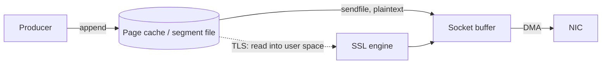

# How Kafka Gets Ordering and Zero-Copy

## The log is the core abstraction

Every Kafka topic is split into partitions, and each partition is an append-only, replicated commit log stored as a directory of segment files on the broker's disk. A record that lands in a partition gets a 64-bit offset, which is the byte position of the start of its batch in the stream. Offsets come from a per-partition atomic counter, so they are monotonically increasing and unique only within that partition. There is no global offset. This is why "Kafka ordering" always needs a partition qualifier.

The log is not a queue with per-consumer bookkeeping. The broker does not track which consumer has seen what. A consumer's position is a single integer per partition, the offset of the next record to read, and the consumer is responsible for committing it.

## Ordering is total within a partition, absent across partitions

Within one partition, a consumer reads records in the exact order they were appended. Across partitions of the same topic, there is no ordering. A consumer group assigns each partition to exactly one consumer at a time, so within a group each partition is processed by one member. That gives you ordering plus horizontal scale, but the two are coupled.

Adding partitions later is the trap. If you start with one partition, key nothing, and later bump the topic to ten partitions, records that used to be ordered together now scatter across partitions and get consumed by different members. You cannot reconstruct the old order from the new layout. If reprocessing order matters, the fix is to put an entity id in the record key. Kafka hashes the key to a partition, so every event for customer 42 lands in the same partition, and any consumer of that partition sees them in order. That only works if you chose a good key from day one. Keying on something low-cardinality, like a country or a status enum, funnels unrelated traffic into one partition and creates a hot spot.

## Sequential writes and the OS page cache

A partition's log is a series of segment files. The active segment gets appended to; when it reaches `log.segment.bytes`, which defaults to 1073741824 (1 GiB), it is rolled and a fresh segment starts. Kafka does not fsync every record. It writes into the OS page cache and lets the kernel flush dirty pages in the background, leaning on replication for durability rather than synchronous disk writes.

This is why Kafka does not fear the filesystem. Appending to the end of a file is sequential I/O, which hardware and the kernel handle far better than random writes. The Apache Kafka design doc gives a concrete comparison from a 6-disk 7200rpm SATA RAID-5 array: linear writes around 600 MB/sec against roughly 100 kB/sec for random writes, a gap of over 6000x. The page cache also means a consumer that is caught up is often served entirely from memory: the same bytes the producer wrote are still resident, and no disk read happens at all.

Retention is applied per segment, not per record. The default `log.retention.hours` is 168 (7 days), and `log.retention.bytes` is -1 (no size limit) by default, so time is the default policy. A segment becomes eligible when its largest timestamp is older than the retention window. Topics can instead use `cleanup.policy=compact`, which keeps the latest value per key rather than dropping old segments, which is what the internal `__consumer_offsets` topic does.

## Zero-copy on the read path

The read path is where the throughput comes from. Normally, moving bytes from a file to a socket copies them four times: disk or page cache into kernel, kernel into a user-space buffer, user space back into the socket buffer, then the socket buffer to the NIC. Kafka skips the two round trips through user space with the `sendfile` syscall.

In the hot path the broker calls `FileRecords.writeTo`, which hands the file channel to the destination channel and lets the kernel run `transferTo`/`transferFrom`, Java's wrapper over `sendfile` on Linux. The bytes go from the page cache to the socket without the broker touching them. The design docs are blunt about the condition: TLS/SSL libraries run in user space, in-kernel `SSL_sendfile` is not supported by Kafka, so when a listener uses `SSL` or `SASL_SSL`, `sendfile` is not used and the payload takes the user-space copy. Turning on TLS buys confidentiality and costs you the zero-copy path.

## Batching and compression

Kafka is a batching system end to end. The producer accumulates records per partition. `batch.size` defaults to 16384 bytes (16 KiB), and `linger.ms` controls how long it waits to fill a batch. That default changed from 0 to 5 in Kafka 4.0, so modern producers add up to 5ms of delay by default in exchange for fuller batches. When a batch is ready it is compressed once as a unit and sent. `compression.type` defaults to `none`, so you have to turn compression on (gzip, snappy, lz4, zstd). Compressing full batches rather than individual records is what gives good ratios, because the redundancy is usually across records.

The broker does not unpack and repack. It decompresses a batch only to validate it, checks the record count against the header and the CRCs, writes the compressed batch to the log, and on a fetch hands the compressed bytes back. The consumer decompresses. So compression saves broker disk, broker-to-consumer network, and client memory at the same time.

Bad keying destroys this. If all keys hash to one partition, batches go to one partition, one broker, one consumer, and compression cannot rescue a workload with no parallelism. The failure is not the batching, it is the key distribution.

## Replication, the high watermark, and what a consumer can read

Each partition has one leader and zero or more followers. Producers write to the leader; followers fetch from it. The set of replicas caught up to the leader is the in-sync replica set (ISR). A follower drops out of ISR if it stops fetching or stops catching up for `replica.lag.time.max.ms`, which defaults to 30000 (30 seconds).

A record is committed once all in-sync replicas have it. The high watermark is the offset up to which data is committed, and a consumer can only read up to it. Data above the high watermark is on the leader's disk but is not yet visible to consumers. This is also why a partition that falls below `min.insync.replicas` stops serving new data to consumers even if a low-`acks` producer keeps writing to it: the watermark stops advancing.

The producer's `acks` setting decides how much it waits for. `acks=0` fires and forgets; `acks=1` waits for the leader; `acks=all` waits for the full ISR. The default is `all`, which changed from `1` in Kafka 3.0 as part of the move to stronger defaults. `min.insync.replicas` defaults to 1, so the common production posture is a topic with replication factor 3, `min.insync.replicas=2`, and `acks=all`: you tolerate one broker down and still need two copies before a write is acknowledged.

## Where the story breaks

None of this gives you global ordering or free exactly-once. The moment you have more than one partition, ordering is per partition only. The moment you run more than one consumer in a group, records from different partitions are processed concurrently and there is no order between them. If your application assumes a single global sequence, you have to build that yourself, and a single partition is the only way to get it, at the cost of throughput.

Exactly-once is real but narrow. It comes from idempotent producers plus transactions plus `isolation.level=read_committed` on the consumer, and it is designed for the read-process-write loop inside Kafka, either Kafka Streams or a hand-rolled producer/consumer pair. A `read_committed` consumer can only read up to the last stable offset, so an open transaction holds back records after it and the consumer temporarily cannot reach the high watermark. Writing to an external system still needs that system to participate, typically by storing the consumer offset alongside the output. Kafka gives you the primitives; it does not make the external system transactional.

The honest summary: Kafka gets ordering and zero-copy by shrinking the problem. One total order per partition, one writer per partition, sequential appends, and a read path the kernel can optimize because the on-disk format is the wire format. Every property you want beyond that has to be paid for with partitions, keys, and transactions.
