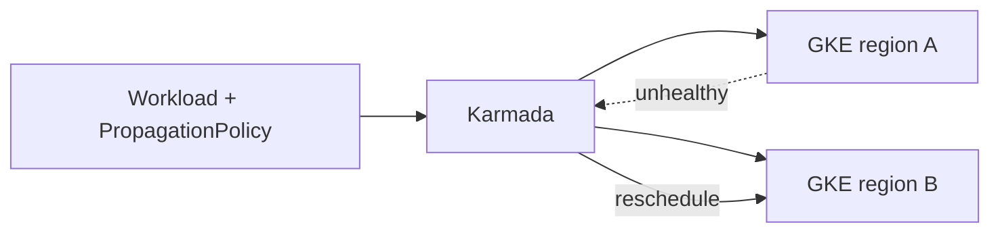

# Karmada: Failover Is a Placement Policy, Not a Script

## TL;DR
Two GKE clusters and a CI job that applied the same manifest to both is not multi-cluster. It is two chances to drift. Karmada takes a single workload and a placement policy: how many replicas per cluster, which clusters are eligible, what happens when a cluster is unhealthy. Failover is that policy executing, not a human rerunning the pipeline.

---

## What we were doing wrong

```text
deploy.sh
  kubectl --context=cluster-a apply -f app.yaml
  kubectl --context=cluster-b apply -f app.yaml
```

Cluster B misses a hotfix. Cluster A has a different image because someone kubectl-edited. There is no "the other cluster is down, put the extra replicas here".



## Placement is the interface

A `PropagationPolicy` names clusters, replica splitting, and taints. A `OverridePolicy` handles the things that must differ: ingress hostname, node pool, secrets per region.

If a difference is not in OverridePolicy, it will be patched by hand and lost. We treated "this cluster uses a different backend bucket" as a one-off for too long.

Failover needs a health signal Karmada believes. Cluster-level not-ready is not the same as "the app is serving 5xx". We hooked cluster health to the API server and node pool, not to the SLO. That is a known gap: Karmada will not move replicas because p99 is bad. That still needs your own controller or a page.

## What I would not do again

- Dual-apply from CI. The control plane will fight you the first time someone kubectl-edits.
- Put region-specific env in the base workload. Overrides exist for a reason.
- Promise automatic regional failover without saying what health means. API-server-up is not the product being up.

The operators I wrote for load balancers and routing sit under this: each cluster still needs its own GCP resources. Karmada places the workload. It does not magically create a global anycast IP. That is a different object, and mixing the two in one mental model is how the runbook gets it wrong.
