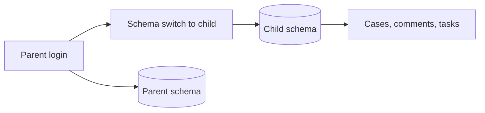

# MSSP Tenancy: The Parent Is Not Just Another User

## TL;DR
An MSSP parent account has child tenants. Parent analysts open a child and work cases there. That is not "the same user with extra permissions". The request is in the child's schema. The actor might only exist in the parent. If `created_by`, assignees, and task views assume `request.user` is a row in the current schema, you get null authors, missing assignees, and a task manager that shows the wrong tenant.

---

## Two identities

Login lives on the parent. The case row lives on the child. `request.user.id` in the child is often none, or a different user object than the parent login.

I had to make case management tenant-aware: writes take an explicit tenant, not "whatever schema the middleware left us in". Task manager had the same bug: it listed tasks for the schema, then tried to join users that only exist on the parent.

## Concrete failures

- **`created_by` null for MSSP users.** The FK pointed at the child `users` table. The parent analyst was not in it. Either map to a child-local actor or store a parent identifier the UI can resolve. Do not leave null and hope the UI says "system".
- **Assignees.** A roster in the parent assigns work on the child. The assignee picker has to list parent users when the session is MSSP, not only child users. We shipped "list all users" and then "allow MSSP users as assignee" as two fixes because the first still filtered the wrong table.
- **Child-created cases, parent session.** A case opened from a child investigation still needs a link the parent can see. Write the routing row where the parent webhook can find it.

## What I would not do again

- Reuse `request.user` as a FK target after a schema switch.
- Teach the UI one "user" type. Parent session users and child-local users have different ids. The API has to say which.
- Fix tenancy in one app (cases) and assume tasks, comments, and shortcuts inherited it. They did not. Shortcut edit from parent-into-child layout was a later, separate bug.

MSSP is a product mode, not a permission bit. Every write path has to name the tenant and the actor separately.
