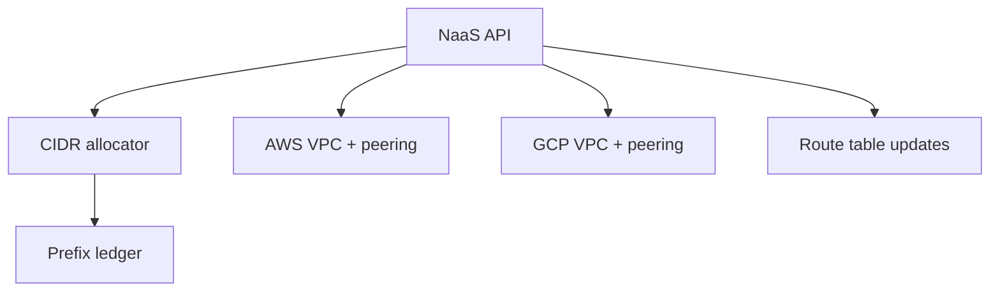

# Network as a Service: Peering Without a Ticket

## TL;DR
Teams needed a VPC in another account, peered back, with a CIDR that did not overlap anything already routed. The ticket path took days. NaaS is an API: allocate a prefix, create the VPC, peer it, write the routes. The cloud SDKs are the easy half. The allocator is the product.

---

## Why tickets fail

CIDR overlap is not visible to the person filing the ticket. They pick `10.0.0.0/16` because every tutorial does. You already have three of those. Peering then fails, or worse, succeeds and blackholes a different team.

## The allocator

A ledger of allocated prefixes, per region, per account, with a lock. Allocate is `SELECT ... FOR UPDATE` on the parent supernet, find a free block of the requested size, insert. Do not let two requests carve the same `/24`.

Release only when the VPC is gone. Orphan prefixes are cheaper than reuse while routes still exist.

IPv4 space is the constraint. You cannot give every team a `/16`. Default to `/24`, allow `/22` with a reason. Record the reason. The next audit will ask.

## Cross-cloud

AWS and GCP peering models are not the same object. The API is: `peer(src, dst)`. The implementation is two adapters. Do not expose "create AWS peering connection" to the caller. They will hardcode it and you will never migrate.

Route propagation has to be explicit. Auto-accept peering without routes is a green API and a blackhole.

## What I would keep

- One ledger, not "look at the live VPCs and infer". Live state lags. The ledger is the lock.
- Fail closed on overlap. Do not "best effort" a peer.
- The API returns the CIDR it allocated, not the CIDR the caller asked for if it had to snap to a size. Callers that ignore the response will route to the wrong prefix.
