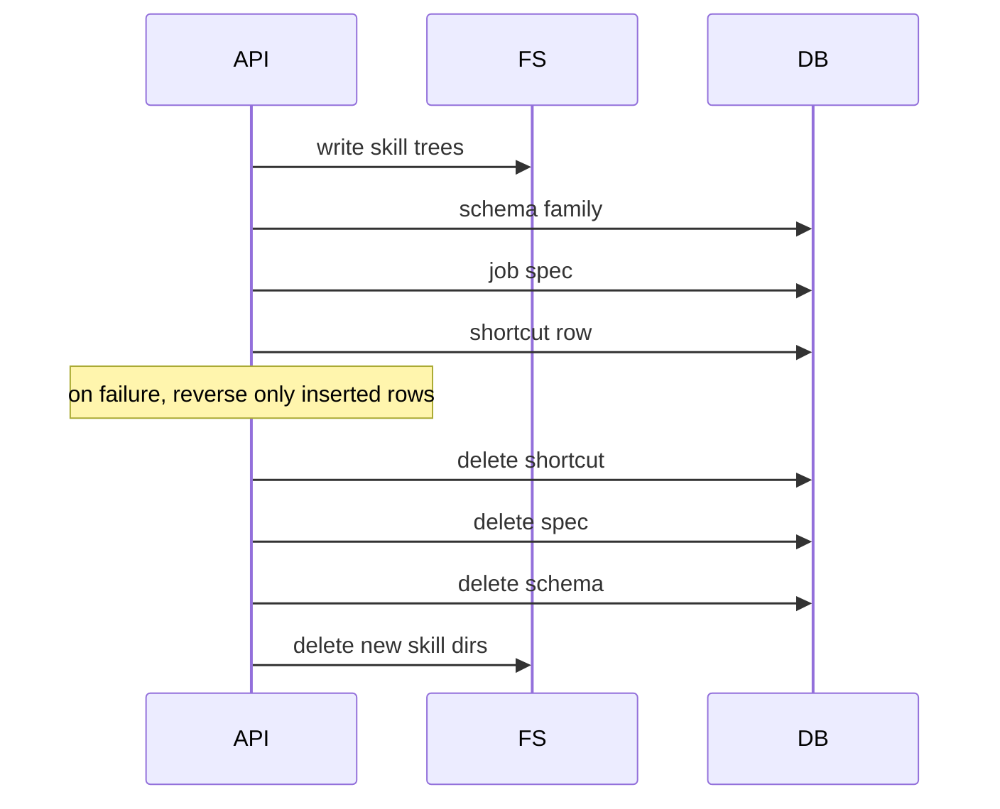

# Shipping a Portable Agent Archive Without Sharing the Runtime

## TL;DR
An agent workflow is not a zip of files. It is a job spec, a mandatory result schema, selected skills, and metadata the destination runtime may not have (placements, feature flags, tenant skills). Export is a closed manifest. Import is create-only, lands disabled, and rolls back in reverse order. Process-local registrations are warnings, not copyable rows.

---

## What is actually portable

We already had an archive format for generic agent specs. It rejected the shortcut namespace and did not know about the extra row that binds a shortcut key to a spec. Reusing it meant either punching holes in the generic importer or dropping the binding.

A separate kind was cheaper.

```text
archive kind: agent.shortcut  v1

manifest
  key
  job spec (controls as stored, empty prompt legal)
  result schema family (mandatory, not optional)
  skill names the operator selected
  placement keys as opaque strings

payload
  spec json
  schema assets
  skill folders (SKILL.md + files)
```

Placements are registered in process code. They are not tenant data. Copying a placement key into another environment does not install the hook. Import keeps the key, leaves the shortcut disabled, and returns `placement_unavailable`.

## Export is not an authorization gate

Skill permissions on the spec are a runtime allowlist: what the agent may load when it runs. They are not an export allowlist. If the operator can see the shortcut, they can bundle any stable tenant skill that still exists.

The only export validation that paid rent:

- selected skills are stable tenant skills (existence)
- the result schema family is complete (never excludable)

Excluding the schema produces a bundle that cannot run and a support ticket that looks like import. Make it impossible.

## Import is create-only

Update-in-place across tenants is how you overwrite someone else's spec and delete skill rows they still use. Import refuses when the key, spec name, inherited copy, schema family, or filesystem directory already exists. Duplicate is 409.

Land disabled:

- shortcut `enabled=false`
- spec `active=false`

The operator turns it on after they see the warnings.

Existing destination skills are skipped by name. Do not fork a second copy of `http-request` because the bundle contained one.

Malformed skill frontmatter is 400. If the generic importer lets that escape as 500, catch it on this path. The operator cannot fix a 500.

## Rollback order

Create order was: skills, schema family, spec, shortcut row. Rollback is the reverse, and only for rows this import inserted. Skipping an existing skill means you must not delete it on failure.



Live-verify this. Export 200, import 201 disabled, duplicate 409, then SQL + filesystem both empty after cleanup. If any of those four fail, the format is not done.

## What I would keep next time

- A closed manifest version. `v1` means you can reject `v2` without guessing.
- DB reads through the DAO. Import that inlines ORM in the view will grow a second copy of "does this skill exist".
- Reuse only pure filesystem/bytes helpers from the generic archive. Do not reuse its reserved-name policy.
- No permission theatre on export. Check existence. Runtime permissions stay runtime.

Portability is a new kind, not a flag on the old importer. The old importer should stay boring.
