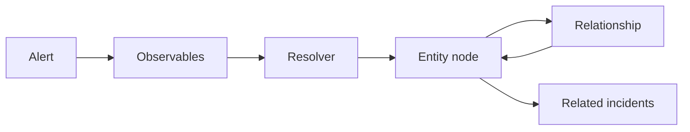

# Related Incidents Are a Graph, Not a Search Box

## TL;DR
"Have we seen this before?" is not `WHERE host = $1`. The same machine shows up as a hostname, a IP, and an agent id. Related incidents are walks on an entity graph: nodes with a stable store id, edges with a type, tags and risk on the node, not on the raw observable. Classification of the edge is the job. String grouping is how you get a hairball.

---

## Observables are not entities

An alert carries observables. An entity is the thing you mean after resolution. Store an entity id on the node the first time you write it. Later alerts attach to that id. If you only store the string, a rename splits the history.

Relationships need a type: same-host, talks-to, issued-by. Untyped "linked" edges cannot be filtered, so the UI shows everything and people stop clicking.

## What we added

- **Semantic relationship ingest**, not "these two strings appeared together".
- **Risk and tags on the entity**, merged from playbooks, not recomputed from the last alert.
- **Filters on risk and tags** so the overview is not the whole graph.
- **A type legend** in the overview response. If the UI has to guess what an edge color means, the API forgot to say.

Related incidents is a walk with a cap, not a recursive CTE that returns the tenant. Cap the hop count. Cap the incident list. The useful question is "the last few cases on this entity", not "every alert that ever shared a subnet".

## Analytics is a different path

Rare-process and frequency views group events. They should not conclude a verdict. We had to stop analytics from writing a verdict just because a process was rare. Rarity is a hint for the graph, not a case outcome.

NaN and empty aggregations will show up. Handle them in the group-by layer. A JSON null in a chart series is a frontend bug you caused in SQL.

## What I would not do again

- Group observables by exact string and call it an entity.
- Let the graph grow untyped edges "for now".
- Run related-incident as a full-tenant search and cache it. It will be wrong the first time two entities share a tag.

The store id is the only join key that survives a rename. Put it on the node early.
