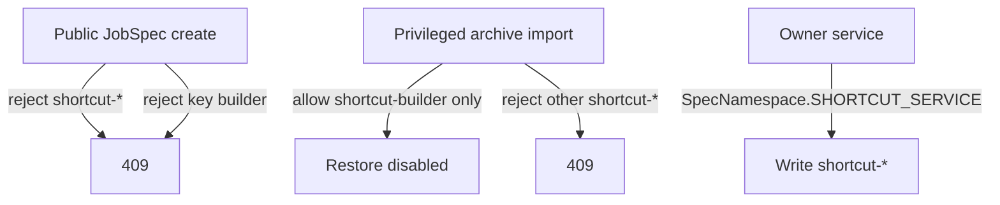

# When One System Artifact Lives in a Reserved Namespace

## TL;DR
We reserved `shortcut-*` so user-created jobs could not collide with the system. Then we needed exactly one system job in that namespace: `shortcut-builder`. Ordinary create still has to reject every `shortcut-*` name. Privileged archive import has to allow that one name, including its result-schema family. The owner key `builder` stays rejected. Three paths, not one flag.

---

## The collision we were avoiding

User-defined shortcuts own a job spec named `shortcut-<key>` and a result schema family with the same prefix. That is convenient: identity is derived, lookup is cheap, and you can forbid the prefix in the public create API.

```text
key "escalate"  -> job spec shortcut-escalate
                -> schema family shortcut-escalate
key "builder"   -> would own shortcut-builder
```

`builder` is the problem. The authoring agent is itself a job spec. If a user can mint key `builder`, they impersonate the authoring path.

So we rejected:

- any create whose name starts with `shortcut-`
- shortcut key `builder` in the public model and in a DB check

That was enough until portability showed up.

## Import is not create

Ordinary create is a user typing a name. Archive import is restoring a bundle that already has a name. The authoring spec has to move between environments. The bundle is named `shortcut-builder`. The public create validator says no.

If you loosen create, users get the system name. If you refuse import, the authoring spec cannot travel.



The rule is per path:

| Path | `shortcut-*` | `shortcut-builder` | key `builder` |
| --- | --- | --- | --- |
| Public create | reject | reject | reject |
| Shortcut owner service | allow (its namespace) | allow | reject as a user key |
| Privileged archive import | reject except the reserved set | allow | n/a |

"Reserved namespace" is not a boolean on the name. It is a matrix of who is allowed to write that name.

## Centralize the reserved set

Hard-coding `builder` in Pydantic and in a check constraint covers today. The next reserved name will miss a path.

Derive application validation and deletion from one reserved-spec set. Create consults it. Import consults it. Delete consults it so a user cannot remove the authoring spec with the public shortcut delete API.

The check constraint can stay as a belt. It is not the policy.

## What broke when we treated import as create

The first archive importer reused the job-spec importer. That importer rejected the prefix, so the authoring spec could not round-trip. Parameterizing the shared importer with "allow reserved names" then let arbitrary `shortcut-*` bundles in through the job-spec door.

The fix was a different archive kind with its own manifest, not a flag on the generic importer. The generic path stays strict. The privileged path names the one exception.

## Lesson

When you reserve a namespace and then put one system artifact inside it, write the create path, the archive import path, and the owner-service path as separate authorization tables. A single `is_reserved` bit will be wrong on at least one of them.
