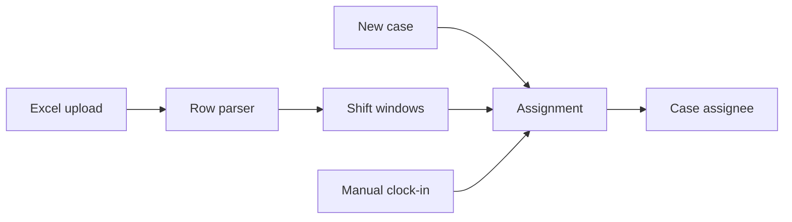

# Assign the Case to Whoever Is On Shift

## TL;DR
MSSP operators work in shifts. Cases should land on whoever is clocked in, not on a round-robin of every user in the tenant. We ingested an Excel roster, turned rows into shift windows, and assigned from that set. The MSSP parent roster wins over the child's. When nobody uploaded a file, people still need to clock in by hand.

---

## The spreadsheet is the source of truth

The customer already had a shift file. Building a pretty calendar they would not fill in is how the feature dies. Ingest the sheet: name, role, start, end, time-off words.

Parsing is where it fails. "Off", "leave", "TO" all mean do not schedule. A cell with a time range in one locale and a dash in another is two bugs. We ended up matching time-off by word list, not by trying to parse every date format the sheet invented.

## Who is eligible

1. Clocked in now, not marked time-off.
2. If the session is MSSP, look at the parent roster first.
3. If the roster is empty, allow manual clock-in. Do not block case create because nobody uploaded a file this month.

Gating clock-in behind a permission (`CLOCK_IN`) stopped random child users from putting themselves on the parent shift.

## What hurt

Assignment ran in the case-create path. A slow roster query made create latency. Cache the "who is on shift right now" set with a short TTL. Shifts change on the hour, not every request.

Empty schedule used to mean "nobody can be assigned", which meant the case sat in a queue nobody owned. Empty has to mean "fall back to the old assignee rules", not "fail closed".

## What I would keep

- Prefer the parent roster in MSSP. Child rosters are incomplete by design.
- Manual clock-in as a first-class path, not an afterthought.
- Do not make the spreadsheet editor our problem. Ingest, don't replace.
