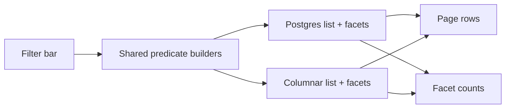

# Same Filter, Two Engines: Postgres vs Columnar NULL Semantics

## TL;DR
I kept one product filter bar over two stores: Postgres for the operational path, a columnar engine for the analytical path. The predicates looked identical. They were not. `IS NOT TRUE` includes NULL on Postgres and drops NULL on several columnar engines. Shared helpers have to take a dialect, or the facet counts and the page silently disagree.

---

## Why two engines

The list page needed interactive filters, sorts, and facet counts. Postgres handled the live path well. The historical path was cheaper on a columnar store: fewer joins, scans instead of nested loops, one wide table instead of a schema-per-tenant layout.

The trap is pretending those are the same SQL dialect with different runtimes.



If the shared builder emits one string, one engine will lie.

## The predicate that diverged

The product needed "not escalated", including rows where the flag was never set.

Postgres, per the docs on boolean operators:

```sql
WHERE is_escalated IS NOT TRUE
-- FALSE  -> keep
-- NULL   -> keep
-- TRUE   -> drop
```

On the columnar engine we were on, `NULL IS NOT TRUE` evaluated to NULL. NULL in `WHERE` drops the row. "Not escalated" silently excluded every row that had never been touched.

The fix is ugly and correct:

```sql
-- Postgres
WHERE is_escalated IS NOT TRUE

-- Columnar (1/0 booleans)
WHERE COALESCE(is_escalated, 0) != 1
```

Do not hide that behind one helper with no dialect argument. I did, once. Facet buckets and the page used different engines for a week and nobody noticed until a filter that should have been a no-op removed rows.

## What else diverges

NULL is the loud one. These were quieter:

- **Sort allowlists.** The UI sent a column name. Each engine mapped it to a physical column. An unmapped name fell back to `updated_at`. The header looked clickable and did nothing.
- **Joins for derived columns.** Assigned-to, SLA, escalation often live on a link table, not the fact row. Legacy rows and harness rows joined on different subject types. The page query and the facet CTE were not the same join. Facets counted a slightly larger universe.
- **Boolean storage.** Postgres `boolean` vs 1/0 tinyint. `IS TRUE` is not portable. Compare against the stored representation.

## A shape that survived

Keep one place that knows the product filter. Give it a dialect.

```python
def not_escalated(col: str, dialect: Literal["postgres", "columnar"]) -> str:
    if dialect == "postgres":
        return f"{col} IS NOT TRUE"
    return f"COALESCE({col}, 0) != 1"
```

Then force every new sortable column, every new facet, and every new predicate through both maps in the same PR. If the columnar path cannot express it, the column is not sortable yet. Silent fallback is a bug.

## What I would not do again

- Share a raw SQL string across engines.
- Trust `IS NOT TRUE` / `IS TRUE` outside Postgres.
- Let the list query and the facet query drift. They will. Put them on the same helpers even if the CTE shape differs.
- Validate only on a staging columnar cluster with zero rows in the interesting bucket. The escalation path was untestable there. I had to construct the rows.

Two engines are fine. One mental model of SQL is not.
