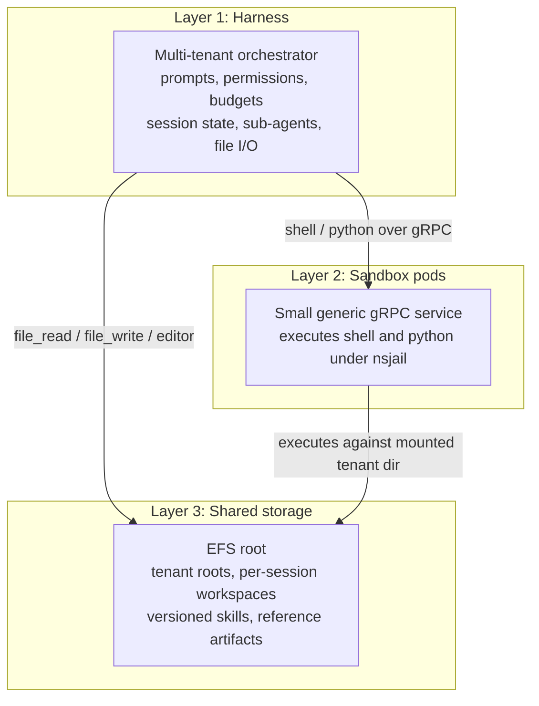

# The Harness Orchestrates, the Sandbox Executes

The single most useful sentence I've written about this system is also the motto that governs its layout: the harness orchestrates, the sandbox executes. Everything else follows from that split. If a rule belongs to the agent, it lives in the harness. If a thing executes code, it lives in the sandbox. There is no third place.

This is the architecture I landed on after several rounds of trying to be clever, and it is deliberately boring. That is the point.

## Three layers

The runtime is three layers, drawn as clean rectangles precisely because they are clean rectangles.

Layer 1 is the harness: a thin, multi-tenant orchestrator. It owns the prompts, the permissions, the budgets, the session state, the sub-agent spawning, and all normal file I/O against an EFS mount. It is where product rules live, because it is the only layer that knows what the product is.

Layer 2 is the sandbox: small generic gRPC service pods that execute shell and Python. That's it. Two verbs. It does not know about tenants as a business concept, it does not know about quotas, it does not know about any product rule. It is a deliberately dumb executor. It does what it is told.

Layer 3 is shared storage: one EFS root, tenant roots as direct children, per-session workspaces, versioned skills, and reference artifacts.

## The execution path contract

The split is concrete at the RPC level. `file_read`, `file_write`, and the editor run in the harness against its own EFS mount. Shell and Python always run inside the sandbox, wrapped in nsjail. There is no overlap and no gray zone.

This contract is the entire reason the control plane stays thin and the data plane stays isolated. The harness never needs sidecar isolation to read a file it already owns; the sandbox never needs to understand policy to run a command someone handed it. Each layer has one job, and the boundary between them is a single well-defined protocol rather than a sprawl of half-enforced rules.

## Isolation is layered, not monolithic

I did not build one impenetrable wall. I built several modest walls that reinforce each other, because a single mechanism either gets tuned into uselessness or gets bypassed when a legitimate case breaks it.

- Tenant-root path validation happens in the harness, before a path ever leaves the orchestrator.
- Pods mount only what they should. A per-tenant pod mounts only its tenant's directory at `/workspace`.
- Execution itself is wrapped in nsjail, seccomp, and AppArmor.
- Network policy restricts what the pod can reach at the cluster level.

None of these alone is a perimeter. Together they mean that a mistake in any one layer gets caught by the others.

## Two pod modes

Pods come in two modes. The default is per-tenant: a pod mounts only its tenant's directory at `/workspace`, so a shell can never even see another tenant's bytes through the filesystem.

There is also an optional global sandbox that mounts the shared root and receives a `tenant_root_path` on each RPC. That sandbox selects the right tenant directory before deriving the working directory and its mounts. The `tenant_root_path` is not a trust boundary, because that sandbox's nsjail mounts are still derived from the resolved tenant directory. It is a routing parameter plus a last-line-of-defense, not a substitute for the mount split.

## Content-addressed sandbox images

Sandbox images are content-addressed artifacts. Each deployment is a base image digest, an image spec derived from a resolved policy, and a readiness gate that refuses to admit a session until a verified artifact exists. "Resolved policy" here is not a tag that can drift; it is a digest that pins exactly what ran.

Immutable digests make "which code ran" answerable after the fact. When something misbehaves, I do not want to reconstruct what might have been deployed; I want the digest of what was. That auditability was worth the overhead of the readiness gate.

## Budgets are controls on the spec

Budgets are not advisory flags passed to the sandbox and hoped for. They are controls on the spec: max tool calls, max dollar spend, max duration, plus nsjail CPU, memory, wallclock, and network limits. When a budget is hit, the denial feeds back to the agent rather than failing silently. The agent sees why it was cut off and can adapt. Silent failure is the worst outcome in an agent runtime, because the agent then retries blind and burns budget doing it.

## Sessions are their own UUIDs

Every session is identified by its own UUID, so two parallel sessions never share a runtime path even when they share a tenant. Skills hot-load into a per-session directory, which means two parallel sessions cannot see or clobber each other's skills. Concurrency is a first-class concern, not something bolted on: two sessions in one tenant are isolated from each other exactly as much as two tenants are. The shared runtime path, the classic footgun, simply does not exist.

## The tradeoff I keep paying for

A generic executor cannot enforce product semantics. This is the cost of the whole design: because the sandbox is deliberately dumb, any product rule that is not expressible in the harness path or permission layer becomes a policy gap. If a rule makes no sense to a dumb executor, the harness must own it, encode it, and live with the added orchestration surface.

Keep product logic out of the executor. The executor's value is that it never drifts into product behavior. The price is that the harness must own every rule, every time, with no shortcut through the sandbox.

## The other tradeoff

Routing all shell and Python through gRPC adds a hop and therefore a failure mode. Every command travels harness to sandbox to filesystem and back, and that round trip can break. The benefit is a hard boundary and the ability to swap the executor entirely without touching the orchestration. Two parallel sessions, one runtime. Replacing the executor later is a small project; untangling policy from execution would have been a rewrite.

If a product rule starts appearing in executor code, that is the smell the whole architecture exists to catch.

## What I would keep

If I had to rebuild this from scratch tomorrow, I would keep the exact same three layers, the same RPC contract, and the same rule that the harness owns every piece of policy. I would keep content-addressed images and the immutable-digest audit trail. I would keep per-session UUIDs and per-session skill directories, because concurrent isolation is where agent platforms actually fail.

The only thing I would change is the beginning. This design looks obvious in hindsight, but getting to "deliberately boring" cost me a few rounds of cleverness first. Start boring. Layer the walls early. Never hand a rule to an executor.
