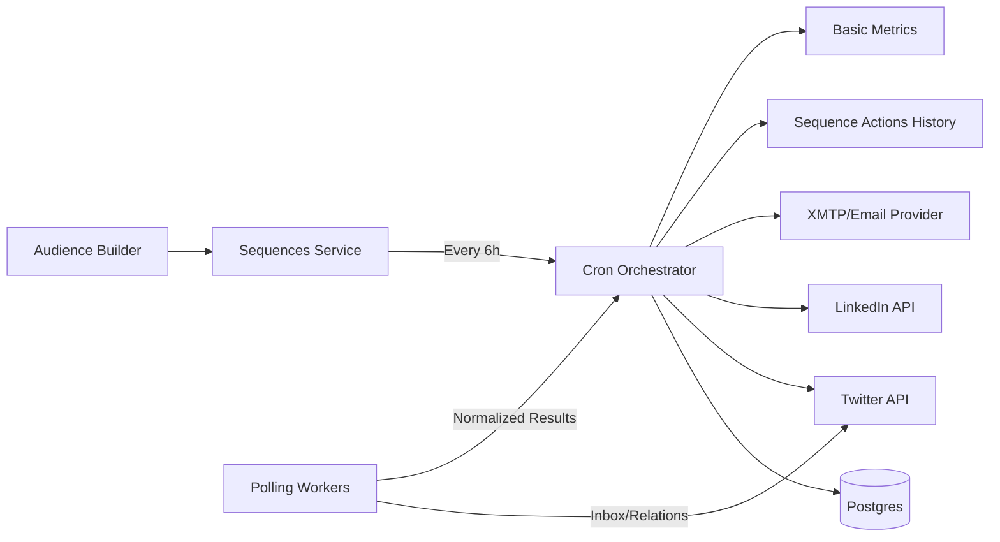
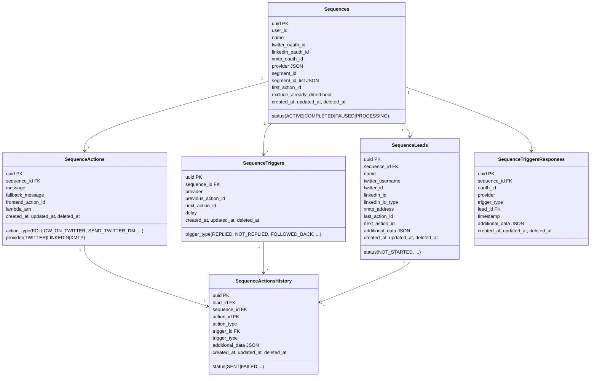
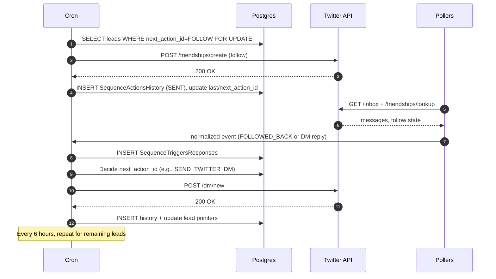

# How We Built Our Outreach Sequences Engine (and What Hurt)

## TL;DR
We built an outreach engine on top of an identity graph linking **Twitter IDs**, **emails**, and **crypto addresses**. Users defined **Sequences** (follow → DM → branch on reply), and a **6-hour cron** advanced every lead through the steps. It worked at scale, but we hit latency, rate-limit pain, and limited observability. This post documents the v1 architecture, the data model, and the cracks we found—groundwork for the next post on the event-driven rebuild.

---

## Context & Goals
- **Audience graph:** ~100M Twitter profiles scraped, plus separate tables for email and crypto; mapping tables linked identities.
- **Static segments:** audiences were snapshots (not dynamic filters).
- **Sequences:** actions and triggers modeled in SQL; templates supported variables and A/B variants.
- **Execution:** a cron ran every 6 hours, locking leads row-by-row and firing the next action, with exponential backoff.
- **Signals:** reply/follow-back detection via **polling** (Twitter inbox/relationships).
- **Limits:** per-account/day/hour, tuned per provider (lowest for Twitter, higher for email).
- **Metrics:** replies, positive replies, reads (basic counts).
- **Gaps:** no DND/consent list, no cross-channel dedup.

---

## HLD — v1 Component Diagram

---

## Data Model (Core Tables)

We modeled sequences as **nodes (actions)** and **edges (triggers)**, with per-lead progress.

### Enums (Actions & Triggers)
- **Actions:** `SEND_CONNECTION_REQUEST`, `SEND_TWITTER_DM`, `SEND_LINKEDIN_DM`, `SEND_XMTP_DM`, `FOLLOW_ON_TWITTER`, `UNFOLLOW_ON_TWITTER`, `CHECK_FOR_REPLY`
- **Triggers:** `REPLIED`, `NOT_REPLIED`, `CONNECTION_ACCEPTED`, `CONNECTION_NOT_ACCEPTED`, `FOLLOWED_BACK`, `NOT_FOLLOWED_BACK`, `END`, `NORMAL_EDGE`, `REPLIED_TO_NOTE`

---

## LLD — v1 Execution Flow (Follow → DM → Branch)

---

## What Hurt (and Why)
- **High latency:** 6-hour ticks meant slow reactions to replies → missed windows.
- **Polling overhead:** reading inboxes for every account is noisy and rate-limit heavy.
- **Coarse rate limiting:** per-day/hour caps help, but without **per-send token buckets** you get bursts or unnecessary throttling.
- **Idempotency risk:** retries + crashes can double-send unless strictly guarded per (lead, action).
- **Limited observability:** no immutable, normalized event log → harder to build funnels and audit trails.
- **Compliance gaps:** no DND/consent enforcement; limited auto-unsubscribe handling.
- **No cross-channel dedup:** the same human could be approached across multiple channels unintentionally.
- **Versioning friction:** editing a sequence in place makes in-flight state tricky.

That’s our honest snapshot of v1—the foundation for the next evolution.
