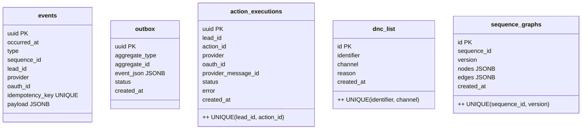

# From Crons to Real-Time: Our Event-Driven Outreach Architecture

## TL;DR
We rebuilt the engine as **event-driven**: sequences compiled into a DAG; a **Trigger Engine** advances leads on inbound events/timeouts; an **Action Scheduler** enforces a **pre-send compliance gate** and **token-bucket rate limits**; **Provider Adapters** send via official APIs; **Inbound Ingestors** normalize replies/follow-backs. We added an **outbox** and an **append-only events log** for auditability. Migration was incremental—no big-bang.

---

## Goals
- React to replies in **seconds**, not hours.
- **Never** double-send (idempotency everywhere).
- Respect platform rate limits safely.
- Gain clear **funnels, analytics, and audit logs**.
- Add **DND/consent** checks up front.
- Keep the existing schema; add only what’s needed.

---

## HLD — Event-Driven Architecture

**Why this matters**
- **Sequence DAG (compiled):** Your `SequenceActions` + `SequenceTriggers` become a versioned graph in `sequence_graphs`. Runtime traversal is O(1).
- **Trigger Engine:** Consumes *inbound* events and *timeouts*, advances the node, emits `ActionScheduled`.
- **Action Scheduler:** Runs **pre-send gate** (DND/consent/caps) and **token-bucket** rate limiting per `(provider, oauth_id)` → queues provider jobs.
- **Provider Adapters:** Stateless workers; only official APIs; emit `ActionSent/Failed` with provider message IDs.
- **Inbound Ingestors:** Prefer webhooks; keep pollers where needed; normalize to domain events.
- **Outbox + events:** Atomic publishing and immutable history for analytics and audits.

---

## LLD — Core Flows

### 1) Reply-Driven Fast Path (Follow → Follow-Back → DM → Positive Reply)

### 2) Timeout Path (No Reply → Apology/Stop)

---

## Data Model Additions (Minimal, Powerful)

### Idempotency Keys
- **Sends:** `UNIQUE(lead_id, action_id)` in `action_executions` prevents duplicate sends across retries.
- **Events:** `idempotency_key = sha256(provider|oauth_id|kind|lead_id|action_id|ts_bucket)` dedupes noisy inbound signals.

### Rate Limiting
- **Token bucket** per `(provider, oauth_id)` in Redis.
- Strict refill rates per platform; no bursts beyond capacity.
- On `429`/`5xx`: exponential backoff + jitter; never drop idempotency guard.

### Pre-Send Gate (Compliance First)
- Check **DND** (`dnc_list`) and tenant-level caps.
- Map **“stop/unsubscribe”** replies to automatic DND enrollment.
- Enforce geo/channel rules if/when you store region/consent metadata.
- Log **ComplianceBlocked** events for audits.

---

## Migration Plan (No Big-Bang)
1. **Eventify the cron**  
   Keep cron/pollers but write `events` via the **outbox**; enforce `action_executions` idempotency now.
2. **Introduce Trigger Engine + Delays**  
   Compile DAGs (`sequence_graphs`), let TE drive next steps on inbound/timeouts; cron becomes a dumb poller.
3. **Move sends to Adapters + Scheduler**  
   Wire token buckets & pre-send gate; deprecate cron decisions; keep pollers until webhooks are ready.

---

## What You Get
- **Seconds-level reaction** to replies/follows instead of 6-hour batches.
- **Zero double-sends** under retries/crashes.
- Clear **funnels & A/B analytics** off a normalized event stream.
- A far better **compliance posture** (DND, audit trail, per-channel caps).

---

## Appendix — Practical Tips
- Include `template_id`/`variant_id` in `ActionScheduled.payload`; persist the chosen variant in `ActionSent`.
- Use FIFO queues with per-lead message-group IDs to guarantee ordering if you go with SQS.
- Build dashboards for queue lag, 429 rate, success/fail per provider, stuck leads, time-to-reply.
- Version sequences; let in-flight leads finish their current version.
