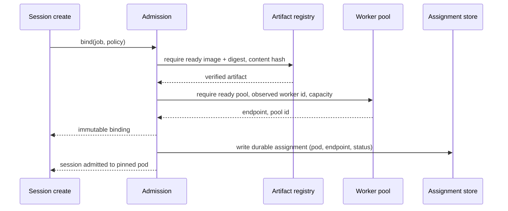

# Pin Every Session to One Sandbox

A task that drives a browser, a desktop, a REPL, or a warm dependency cache needs the same box across turns and reconnects. If each turn picks a random warm pod, you lose the filesystem state, the live process, and every piece of cached work. For a single-step stateless request that is fine. For computer-use agents, it is fatal.

The naive fix is a sticky load balancer keyed on something. Any "stickiness" that both sides can re-derive from scratch is broken by construction. The control plane and the worker can disagree about which pod is current, and there is no durable record to validate against. When they disagree, you lose the session and you will debug it from a screenshot that no longer matches the page.

What worked for us was three stages: admission, then a durable assignment, then fail-closed routing.

## Admission before the session exists

Placement does not happen at request time. It happens before the session row is created, because that is the only moment where you can refuse to proceed cleanly.

Admission resolves the policy and image spec for the job. It requires:

- a verified, ready image artifact,
- a ready worker pool with observed worker identity,
- and it returns one immutable binding of artifact id, image digest, content hash, policy fingerprint, worker pool id, and endpoint.

If any piece is missing, it refuses to create the session. You do not start a half-configured box. Better to fail the create than to silently hand the agent a pod that lacks the image it will pull, the policy it must respect, or the endpoint it needs to report through.

## The binding is immutable

After creation, the binding does not change. There is an explicit allowlist of a couple of late-bind fields that may be filled exactly once (the target scope and its hash). Everything else that differs from the original binding raises a validation error. There is no "update" path that quietly rewrites the pod, the digest, or the endpoint.

Immutability is what makes admin intent match runtime reality. The moment a binding becomes writable, two pieces of state drift apart and you no longer know what you delivered.

## A durable assignment, one per session binding

Next there is a durable session-to-pod assignment row, one per session binding, recording the actual pod identity and endpoint. It carries a status (`pending`, `active`, `degraded`, `released`), a lease owner, a lease generation, and an assignment generation. A released assignment is never reused. That last rule matters: reusing a released pod id is how a recycled box gets handed to a session carrying another session's memory.

How a pod is chosen depends on mode:

- Pooled mode picks the least-occupied eligible pod with remaining capacity, and refuses to co-locate pods whose egress policy hashes are incompatible.
- Session-dedicated mode asserts that the pod uid is not already assigned to another active session.

## Fail-closed routing

Routing is the stage where most systems reintroduce the bug they were trying to fix. Mine does not.

Resolve the ready worker for the session, load the single active assignment, then validate that the assignment tenant, session id, worker id, and pod uid all match the worker. Any mismatch raises. There is no fallback to "some other pod". A missing or incomplete assignment is an error, not a cache miss.

The difference between fail-open and fail-closed is the difference between "the agent ran somewhere" and "the agent ran where its state lives". Any other pod is a fresh empty box with no process, no cache, and no memory of the task. Failing open never helps.

## The lease is the real lock

Two reconcilers will both try to claim a session after a controller restart. The lease is what stops them. Writes validate the lease owner, the lease generation, and the assignment generation; a stale writer is rejected.

Occupancy counts are derived from active assignments, and they are explicitly not authoritative. Capacity is still enforced under a row lock. Derived counts are fine for picking a least-occupied pod, but they are not allowed to greenlight a placement, because a stale counter is exactly the failure you are trying to kill.

## What you give up

An assignment is a bottleneck and a single point of routing failure for that session. One row, one lease, one writer. You trade elasticity for statefulness: you cannot treat any warm pod as interchangeable, because for this session it is not. Leases and generations add bookkeeping to every write.

I think that cost is correct. Without leases and generations, a retry or a controller restart silently moves a session to a fresh box and destroys the state the task depends on. That is not a scheduling slip; it is a lost session. The bookkeeping is cheap compared with explaining to the agent why its files are gone.

## The general lesson

For stateful agent work, placement is not a load-balancing decision. It is part of the session identity. Treat it that way: make it explicit, durable, and validated. Do not invent stickiness on the fly and hope both sides agree on it. They will not, and you will debug it from a screenshot that no longer matches the page.
